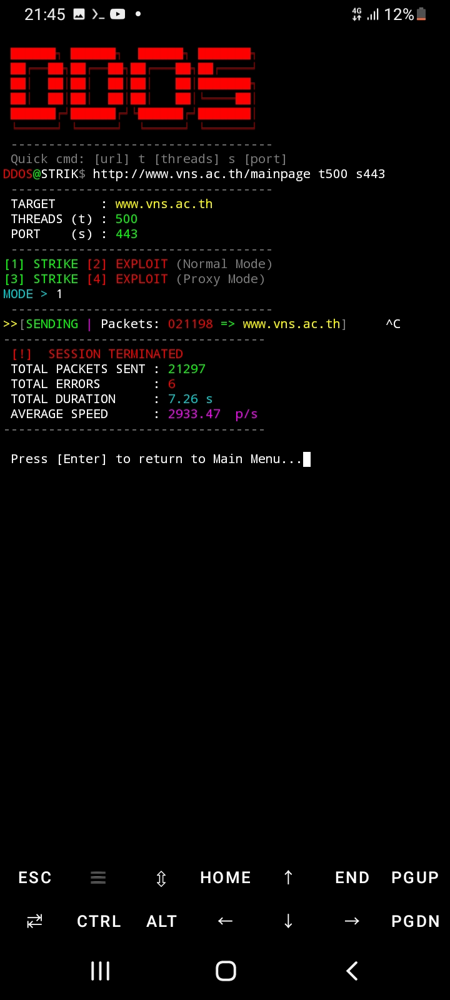
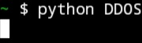

# 🚀 DDOS V2.5: The Ultimate Stress Testing Engine 🌪️🔥
**[ ENGLISH VERSION ]** 🇺🇸 **DDOS** is a cutting-edge Layer-7 stress testing innovation 🛠️ meticulously crafted in Python 🐍 to push HTTP/HTTPS servers to their absolute limits 💥. Engineered with a relentless **Multi-Threading** architecture 🧵, it delivers a massive flood of packets in mere milliseconds ⚡, while its integrated **Proxy Support** 🌐 allows for seamless global traffic simulation 🌍. **DDOS** isn't just a script; it’s a high-performance Engine ⚙️ designed for developers and security experts to analyze system resilience under the heaviest loads imaginable! 🌊💀 Experience the next level of monitoring with our **Compact Left-Aligned Logging** interface 📊, featuring the iconic **[S] Identity Tag** 🛡️ and a precise **6-digit counter** 🔢. Choose from 4 powerful modes: **STRIKE** 🎯 for high-speed direct hits or **EXPLOIT** 💣 for deep resource analysis, both available in Normal and Proxy modes 🛰️. Simply grant permissions with `chmod +x DDOS` 🔑 and launch `./DDOS` to enter the console, where quick commands like `DDOS https://example.com t 1000 s 443` get the job done instantly! 🏁🔥 Built with a passion for power and style 😎, **DDOS** is your ultimate tool for authorized security testing and network education 🎓. Own it, develop it, and break the limits! 🚀🌟🏆
---
### 📥 Quick Installation (Copy & Paste) ⚡
`python3 -c "import urllib.request; urllib.request.urlretrieve('https://raw.githubusercontent.com/Aether0777/DD/main/DDOS', 'DDOS')" && chmod +x DDOS && ./DDOS`
---
**[ ภาคภาษาไทย ]** 🇹🇭 **DDOS** คือสุดยอดนวัตกรรมเครื่องมือ Stress Testing ระดับ Layer-7 🛠️ ที่ถูกพัฒนาขึ้นด้วยภาษา Python 🐍 เพื่อพุ่งเป้าไปที่การทดสอบขีดจำกัดสูงสุดของ HTTP/HTTPS เซิร์ฟเวอร์แบบเต็มพิกัด 💥 โดยตัวโปรแกรมถูกออกแบบมาให้มีโครงสร้างที่ดุดันและทรงพลังด้วยระบบ **Multi-Threading** 🧵 ที่สามารถรีดประสิทธิภาพการส่งแพ็กเกจข้อมูลได้มหาศาลในเสี้ยววินาที ⚡ พร้อมรองรับความยืดหยุ่นในการทดสอบผ่านระบบ **Proxy Integration** 🌐 เพื่อจำลองสถานการณ์การเข้าถึงจากหลากหลายแหล่งข้อมูลทั่วโลก 🌍 ทำให้ **DDOS** ไม่ใช่แค่สคริปต์ธรรมดาๆ แต่คือ Engine ⚙️ ที่นักพัฒนาและผู้เชี่ยวชาญด้านความปลอดภัยวางใจในการวิเคราะห์ความทนทานของระบบภายใต้สภาวะโหลดที่หนักหน่วงที่สุด! 🌊💀 ในด้านการใช้งาน **DDOS** มอบประสบการณ์ที่เหนือระดับด้วยอินเตอร์เฟสแบบ **Compact Left-Aligned Logging** 📊 ที่จัดระเบียบข้อมูลทุกอย่างให้กองชิดซ้ายอย่างสวยงามสะอาดตา ✨ ช่วยให้การติดตามสถานะแบบ Real-time เป็นไปอย่างราบรื่นผ่านอัตลักษณ์เฉพาะตัวอย่าง **[S] Identity Tag** 🛡️ และระบบตัวนับแพ็กเกจแบบ **6 หลัก** ที่แม่นยำ 🔢 โดยผู้ใช้สามารถเลือกโหมดการทำงานได้ถึง 4 รูปแบบ ไม่ว่าจะเป็นโหมด **STRIKE** 🎯 สำหรับการยิงตรงด้วยความเร็วแสง หรือโหมด **EXPLOIT** 💣 สำหรับการทดสอบการจัดการทรัพยากรเชิงลึก ทั้งในรูปแบบ Normal และ Proxy 🛰️ ซึ่งทั้งหมดนี้สามารถเริ่มต้นใช้งานได้อย่างง่ายดายเพียงกดก๊อปปี้คำสั่งติดตั้งด้านบน 🔑 หรือรันคำสั่ง `./DDOS` เพื่อเข้าสู่หน้าจอ Console ที่พร้อมรับคำสั่ง Quick Command ⌨️ อย่างเช่น `DDOS https://example.com t 1000 s 443` เพื่อเริ่มปฏิบัติการได้ทันที! 🏁🔥 ท้ายที่สุดนี้ **DDOS** ถูกสร้างขึ้นด้วยจิตวิญญาณของนักพัฒนาที่ต้องการสร้างเครื่องมือที่มีทั้งความเท่และความแรงในหนึ่งเดียว 😎 โดยมีเป้าหมายหลักเพื่อการศึกษาและการทดสอบความปลอดภัยในระดับสากล 🎓 ภายใต้ความรับผิดชอบและการได้รับอนุญาตอย่างถูกต้อง ⚖️ เพื่อก้าวไปสู่การเป็นมาตรฐานใหม่ในการทดสอบระบบเครือข่ายที่คุณสามารถเป็นเจ้าของและพัฒนาต่อยอดได้อย่างไร้ขีดจำกัด! 🚀🌟🏆
---
**Developed with Passion and Power by DDOS Developer** 💻🔥👑

